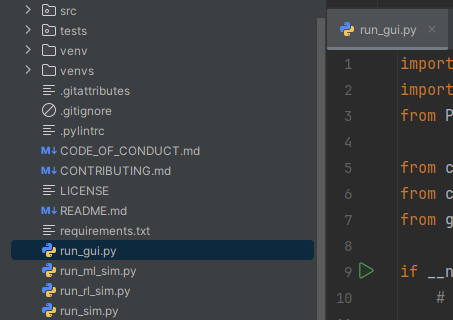
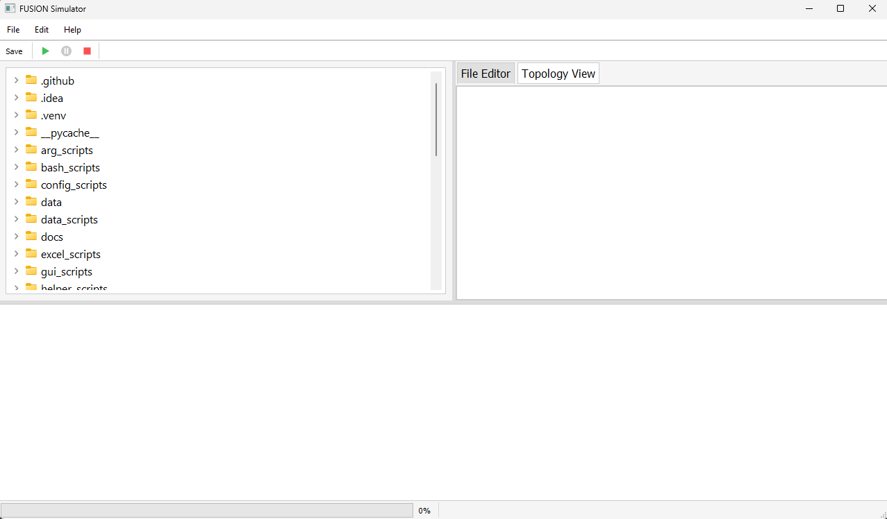

Using the GUI
=============

To open the GUI:

Main Window Overview
--------------------

The main window looks like this:

Using the Controls
-------------------

1. **Load a Simulation Scenario**

   Click the "Load" button on the toolbar:

   .. image:: _images/gui_load_button.png
      :alt: Load Button
      :width: 200px

2. **Run the Simulation**

   Click the "Run" button:

   .. image:: _images/gui_run_button.png
      :alt: Run Button
      :width: 200px

...

Additional Tips
---------------

- Make sure your configuration files are correctly set before running the simulation.
- Use the status bar at the bottom to monitor simulation progress.
